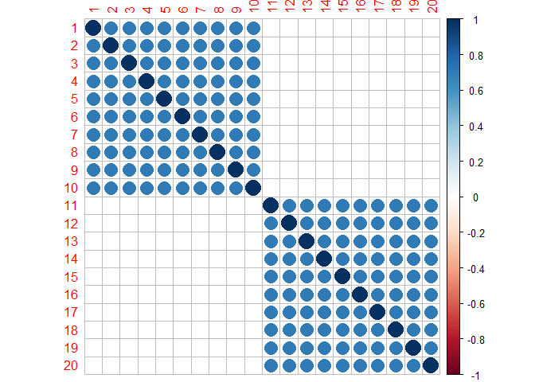
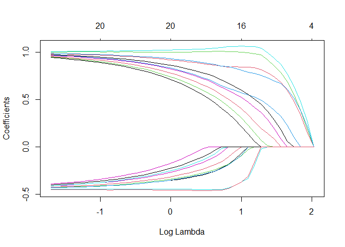
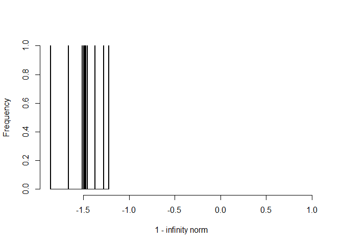
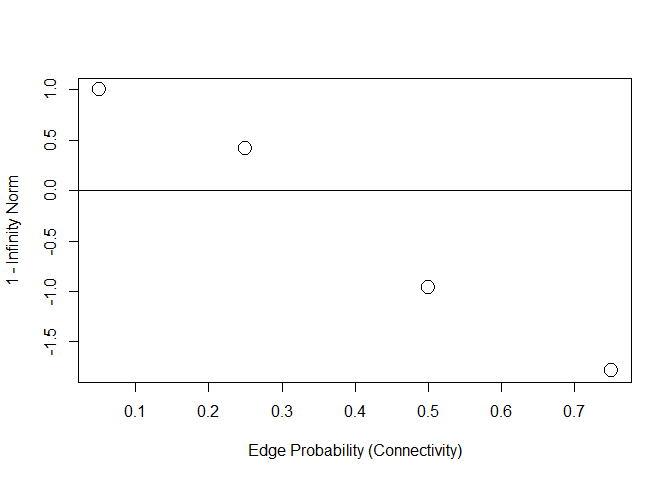

<!-- README.md is generated from README.Rmd. Please edit that file -->


# IRCcheck: Irrepresentable Condition Check

[](https://cran.r-project.org/package=IRCcheck)
[](https://cran.r-project.org/package=IRCcheck)
[](https://circleci.com/gh/donaldRwilliams/IRCcheck)

The goal of IRCcheck is to check the irrepresentable condition in both
L1-regularized regression (Equation 2 in Zhao and Yu 2006) and Gaussian
graphical models (Equation 8 in Ravikumar et al. 2008). At it crux, the
IRC states that the important and unimportant variables cannot be
correlated, at least not all that much (total irrelevant covariance
below 1).

L1-regularization requires the IRC for consistent model selection, that
is, with more data, the true model is recovered.

The IRC cannot be checked in real data. The primary use for this package
is to explore the IRC in a true model that may be used in a simulation
study. Alternatively, it is very informative to simply look at the IRC
as a function of sparsity and the number of variables, including the
regularization path and model selection.

## Installation

You can install the development version from
[GitHub](https://github.com/) with:

``` r
# install.packages("devtools")
devtools::install_github("donaldRwilliams/IRCcheck")
```

## Example: IRC is met exactly

Here it is assumed that there is *no* covariance between the important
(active) and unimportant variables.

``` r
library(IRCcheck)
# install from github
library(GGMnonreg)
library(GGMncv)
library(corrplot)
library(corpcor)
library(glmnet)
library(MASS)
library(psych)

# block diagonal
cors <- irc_met <- rbind(
  cbind(matrix(.7, 10,10), matrix(0, 10,10)),
  cbind(matrix(0, 10,10), matrix(0.7, 10,10))
)
diag(cors) <- 1


# visualize
# note: first 10 are 'active'
corrplot(cors)
```



In this plot, variables 1 through 10 and 11 through 20 are correlated
with each other. The latter are assumed to be “active” for predicting
the response and the former are truly null associations. Notice there is
no correlation between the sets.

Let’s inspect the regularization path

``` r
# beta
beta <- c(rep(1, 10), rep(0, 10))

set.seed(2)
X <- MASS::mvrnorm(n = 500, mu = rep(0, 20), Sigma = cors)

# SNR = 5
sigma <- sqrt(as.numeric(crossprod(beta, cors %*% beta) / 5))

set.seed(2)
# note: first 10 are 'active'
y <- X %*% c(rep(1, 10), rep(0, 10)) + rnorm(500, 0, sigma)

# fit model
fit <- glmnet(X, y)

# visualize
plot(fit, xvar = "lambda")
```



## Example: IRC is not met

Here I generate a correlation matrix from a Wishart distribution.

``` r
# random correlation matrix
set.seed(2)
cors <- cov2cor(
  solve(
    rWishart(1, 20 , diag(20))[,,1]
  ))

# visualize
corrplot(cors)
```


Now there are correlations between the sets, which, in my experience, is
the more realistic situation (albeit these are very strong
correlations).

Here is how to check the IRC in regression with **IRCcheck**

``` r
# SNR = 5
sigma <- sqrt(as.numeric(crossprod(beta, cors %*% beta) / 5))

set.seed(2)
X <- MASS::mvrnorm(n = 500, mu = rep(0, 20), Sigma = cors)

# if negative it is not met
1 - irc_regression(X, 1:10)
#> [1] -0.9509886
```

Let’s inspect the regularization path

``` r
set.seed(2)
y <- X %*% c(rep(1, 10), rep(0, 10)) + rnorm(500, 0, sigma)

# fit model
fit <- glmnet(X, y)

# visualize
plot(fit, xvar = "lambda")
```


Quite the difference (e.g., all true coefficients are positive). Note
that the goal is then to select lambda, which will be quite the
difficult task when the IRC is not satisfied.

## Gaussian Graphical Models

For GGMs, I find it easier to work with a partial correlation matrix and
then randomly take subsets. The following looks at partial correlations
estimated from items assessing personality.

``` r
# partials from big 5 data
pcors <- corpcor::cor2pcor(cor(na.omit(psych::bfi[,1:25])))

# collect
irc <- NA 

for(i in 1:10){
  
   # randomly select 20
  id <- sample(1:25, size = 20, replace = F)
  
  # submatrix
  pcor_sub <- pcors[id, id]
  
  # true network
  true_net <- ifelse(abs(pcor_sub) < 0.05, 0, pcor_sub)
  
  irc[i] <- irc_ggm(true_net)
}

hist(1- irc, breaks = 100, 
     xlab = "1 - infinity norm", 
     main = "", xlim  = c(min(1 - irc), 1))
```



``` r

# failed
mean(1 - irc < 0)
#> [1] 1
```

Note that negative fails, as the irrelevant covariance exceeded 1. In
fact, the IRC was not satisfied in any of the checks (10 iterations).

The IRC will fail less often with fewer variables. Also, if `0.05` is
changed to a larger value this will result in more sparsity. As a
result, the IRC will be satisfied more often.

## A Mere Statistical Curiosity?

It might be tempting to think that violating IRC, like many other
assumptions, will have some effect but perhaps not all that much. In my
experience, the importance of the IRC cannot be understated: it has a
**HUGE** impact on false positives. The following is a somewhat “ugly”
example.

Let’s hold all constant (p and effect size) but sparsity and examine the
infinity norm (must be less than 1). Below, `gen_net` generates a true
network, or GGM, with partial correlations in a certain range (`lb` and
`ub`).

``` r
# 5 % connections (95 % sparsity)
eprob_05 <- IRCcheck::gen_net(
  p = 10,
  edge_prob = 0.05,
  lb = 0.05,
  ub = 0.25
)

# 25 % connections (75 % sparsity)
eprob_25 <- IRCcheck::gen_net(
  p = 10,
  edge_prob = 0.25,
  lb = 0.05,
  ub = 0.25
)

# most networks in the social-behavioral sciences are **not** sparse
# 50 % connections (50 % sparsity)
eprob_50 <- IRCcheck::gen_net(
  p = 10,
  edge_prob = 0.50,
  lb = 0.05,
  ub = 0.25
)

# 75 % connections (25 % sparsity)
eprob_75 <- IRCcheck::gen_net(
  p = 10,
  edge_prob = 0.75,
  lb = 0.05,
  ub = 0.25
)

# compute infinity norms
ircs <-
  sapply(list(eprob_05, 
              eprob_25, 
              eprob_50, 
              eprob_75), function(x) {
    IRCcheck::irc_ggm(x$pcors)
  })

# plot
plot(
  c(0.05, 0.25, 0.50, 0.75),
  1 - ircs,
  cex = 2,
  ylab = "1 - Infinity Norm",
  xlab = "Edge Probability (Connectivity)"
)
abline(h = 0)
```



Because I subtracted 1, negative values fail to meet the IRC. As the
graph becomes less sparse (higher edge probability) the infinity norm
becomes larger, i.e., the covariance between the unimportant and
important increases, which should translate into more false positives.

Now let’s check specificity (1 - the false positive) in simulated data.
At each step, the IRC is increasingly violated.

### 95% Sparsity

``` r
set.seed(1)
# data
Y <- MASS::mvrnorm(n = 5000,
                   rep(0, 10),
                   Sigma = eprob_05$cors,
                   empirical = FALSE) 

# non regularized, for comparison
fit <- GGMnonreg::ggm_inference(Y, boot = FALSE)

# specificity
IRCcheck:::compare(True = eprob_05$adj, 
                   Estimate = fit$adj)[1,]
#>       measure     score
#> 1 Specificity 0.9767442

# lasso
fit <- GGMncv::ggmncv(cor(Y), n = 5000,
                      penalty = "lasso", 
                      progress = FALSE)

# specificity
IRCcheck:::compare(True = eprob_05$adj, 
                   Estimate = fit$adj)[1,]
#>       measure     score
#> 1 Specificity 0.9767442
```

Notice that both methods work well.

### 75% Sparsity

``` r
set.seed(1)
# data
Y <- MASS::mvrnorm(n = 5000,
                   rep(0, 10),
                   Sigma = eprob_25$cors,
                   empirical = FALSE) 

# non regularized, for comparison
fit <- GGMnonreg::ggm_inference(Y, boot = FALSE)

# specificity
IRCcheck:::compare(True = eprob_25$adj, 
                   Estimate = fit$adj)[1,]
#>       measure score
#> 1 Specificity     1

# lasso
fit <- GGMncv::ggmncv(cor(Y), 
              n = 5000, 
              penalty = "lasso", 
              progress = FALSE)

# specificity
IRCcheck:::compare(True = eprob_25$adj, 
        Estimate = fit$adj)[1,]
#>       measure     score
#> 1 Specificity 0.8235294
```

### 50% Sparsity

Now we are getting to a level of sparsity that is common in, say, the
social-behavioral sciences.

``` r
set.seed(1)
# data
Y <- MASS::mvrnorm(n = 5000,
                   rep(0, 10),
                   Sigma = eprob_50$cors,
                   empirical = FALSE) 

# non regularized, for comparison
fit <- GGMnonreg::ggm_inference(Y, boot = FALSE)

# specificity
IRCcheck:::compare(True = eprob_50$adj, 
                   Estimate = fit$adj)[1,]
#>       measure     score
#> 1 Specificity 0.9130435

# lasso
fit <- GGMncv::ggmncv(cor(Y), 
              n = 5000, 
              penalty = "lasso", 
              progress = FALSE)

# specificity
IRCcheck:::compare(True = eprob_50$adj, 
        Estimate = fit$adj)[1,]
#>       measure     score
#> 1 Specificity 0.3913043
```

### 25% Sparsity

An even denser graph, which is not uncommon.

``` r
set.seed(1)
# data
Y <- MASS::mvrnorm(n = 5000,
                   rep(0, 10),
                   Sigma = eprob_75$cors,
                   empirical = FALSE) 

# non regularized, for comparison
fit <- GGMnonreg::ggm_inference(Y, boot = FALSE)

# specificity
IRCcheck:::compare(True = eprob_75$adj, 
                   Estimate = fit$adj)[1,]
#>       measure score
#> 1 Specificity     1

# lasso
fit <- GGMncv::ggmncv(cor(Y), 
              n = 5000, 
              penalty = "lasso", 
              progress = FALSE)

# specificity
IRCcheck:::compare(True = eprob_75$adj, 
        Estimate = fit$adj)[1,]
#>       measure score
#> 1 Specificity     0

# false positive rate
1 - IRCcheck:::compare(True = eprob_75$adj, 
            Estimate = fit$adj)[1,2]
#> [1] 1
```

At each step along the way, the false positive rate for (g)lasso
increased to be shockingly high. On the other hand, the non-regularized
method based on good old *p*-values had no issue.

Together, this simple example demonstrated that the false positive rate
is a function of the IRC.

## References

<div id="refs" class="references">

<div id="ref-ravikumar2008model">

Ravikumar, Pradeep, Garvesh Raskutti, Martin J Wainwright, and Bin Yu.
2008. “Model Selection in Gaussian Graphical Models: High-Dimensional
Consistency of L1-Regularized Mle.” In *NIPS*, 1329–36.

</div>

<div id="ref-Zhao2006">

Zhao, Peng, and Bin Yu. 2006. “On Model Selection Consistency of Lasso.”
*The Journal of Machine Learning Research* 7: 2541–63.
<https://doi.org/10.1109/TIT.2006.883611>.

</div>

</div>
